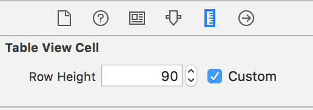
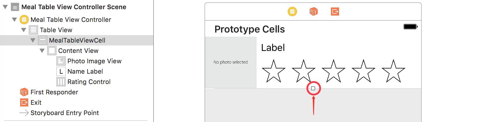

# FoodTracker
Note: Start Developing iOS Apps (Swift)

### Work with View Controllers
* view controller 的生命周期
* 修改 intrinsic content size 为 Placeholder
* guard 的 用法
* 直接把图片拖入模拟器可以添加图片到相册中

### Implement a Custom Control
* 当添加一个 view 到 stack view 里时. 在使用 Auto Layout 的情况下, 把 view 的translatesAutoresizingMaskIntoConstraints 属性设置成 false 是一个好习惯. 这个属性默认是 true, 会给自动添加约束.
* @IBDesignable 的使用, 让代码和 IB 互动起来
* 支持 VoiceOver

### Define Your Data Model
* unit test 单元测试 model

### Create a Table View
* 一点小 bug, 在 storyboard 中设置 tableViewController 的 cell 时, 直接在输入框内输, 不能作用到应用上.

fix: 选中 tableViewCell 点击方块拖到需要的数值, 重新运行就好了, 可能是 Xcode 这个版本的 bug, 也可能是偶发性 bug. 囧

### Implement Navigation
* segue 的使用
push style: 用于下钻式界面结构
modal: 添加项目属于一种模态操作, 因为用户执行完整的自包含的操作, 然后返回主导航. 
* os.log unified logging system
* nil coalescing operator (??)
* using segue unwinding

### Implement Edit and Delete Behavior

### Persist Data
* 使用 NSCoding 做数据持久化
